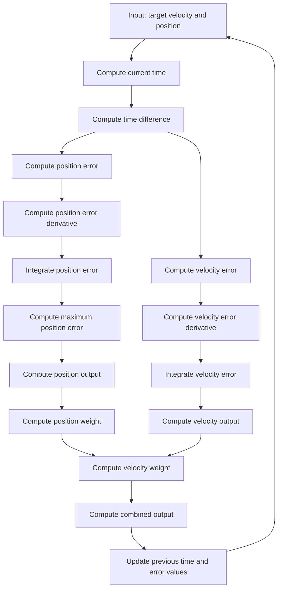

# MYBOT

An arduino robot built for NYCU ME 2024 mechanical practice course. It is a car-like robot that consists of a four wheel drive system and a 5 DOF robotic arm. The robot is controlled by smartphone via bluetooth.

## Hardware

- Arduino Mega 2560
- HC-05 Bluetooth Module
- 4x CHR-GM37 Motor with Encoder
- 5x Servo Motor
- 2x L298N Motor Driver
- 6x 18650 Battery
- 2x 18650 Battery Holder
- 2x Laser cutting aluminum plate

## Software

## Schematic

## Control Method



$$
\begin{align*}
\text{pos\_weight\_base} &= 100 \\
\text{pos\_error\_percent} &= \frac{|\text{pos\_error}|}{\text{pos\_error\_max}} \quad \text{(Value domain: } [0, 1]) \\
\text{vel\_weight} &= \frac{{\text{pos\_weight\_base}}^{\text{pos\_error\_percent}} - 1}{\text{pos\_weight\_base} - 1} \quad \text{(Value domain: } [0, 1]) \\
\text{pos\_weight} &= 1 - \text{vel\_weight}
\end{align*}
$$

## Usage

It is recommended to use the docker image to compile the code, you can also use the platformio extension in vscode.

For docker user, you can use the following commands:

To build the docker image

```sh
make install
```

To compile the code

```sh
make build
```

To upload the code to the arduino

```sh
make upload
```
