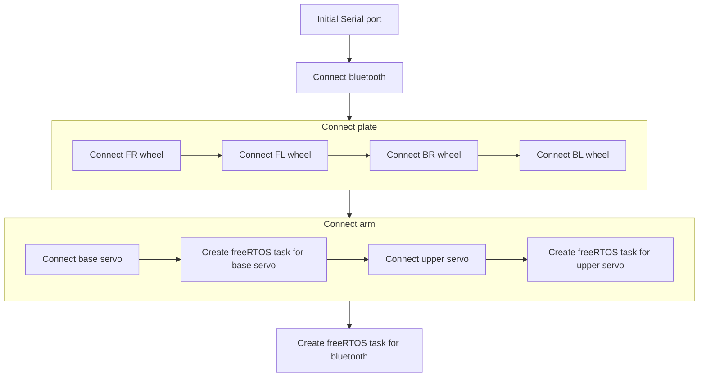
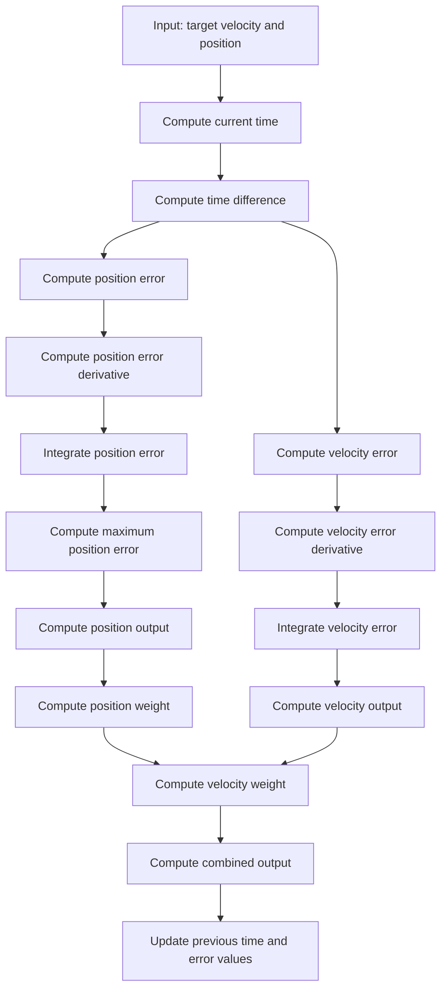

# MYBOT

An arduino robot built for NYCU ME 2024 mechanical practice course. It is a car-like robot that consists of a four wheel drive system and a 2 DOF robotic arm. The robot is running on FreeRTOS and controlled by smartphone via bluetooth.

## Hardware

- Arduino Mega 2560
- HC-05 Bluetooth Module
- 4x CHR-GM37 Motor with Encoder
- 2x RDS3235 35kg Servo
- 2x L298N Motor Driver
- 6x 18650 Battery
- 2x 18650 Battery Holder
- 2x Laser cutting aluminum plate

## Software

## Schematic

My teammate LuLu is responsible for the schematic design. The schematic is shown below.


## Control Method

### Setup



### Main Control Loop

### COMP_PID



$$
\begin{align*}
\text{pos weight base} &= 100 \\
\text{pos error percent} &= \frac{|\text{pos error}|}{\text{pos error max}} \quad \text{(Value domain: } [0, 1]) \\
\text{vel weight} &= \frac{{\text{pos weight base}}^{\text{pos error percent}} - 1}{\text{pos weight base} - 1} \quad \text{(Value domain: } [0, 1]) \\
\text{pos weight} &= 1 - \text{vel weight}
\end{align*}
$$

## Usage

It is recommended to use the docker image to compile the code, you can also use the platformio extension in vscode.

For docker user, you can use the following commands:

To build the docker image

```sh
make install
```

To build the code and upload to the arduino

```sh
make
```

To compile the code only

```sh
make build
```

To upload the code to the arduino only

```sh
make upload
```

To attach the docker container

```sh
make attach
```
