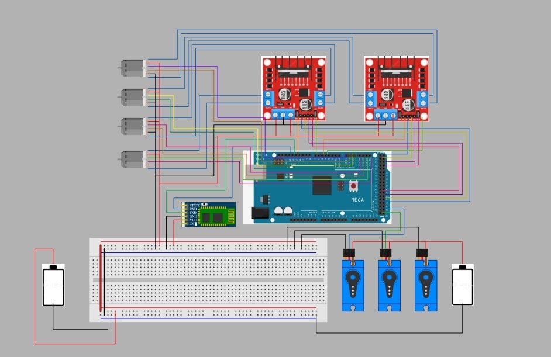
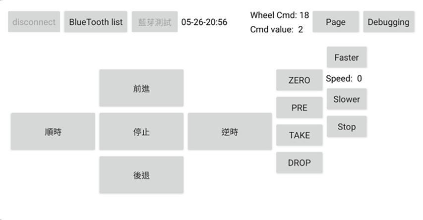
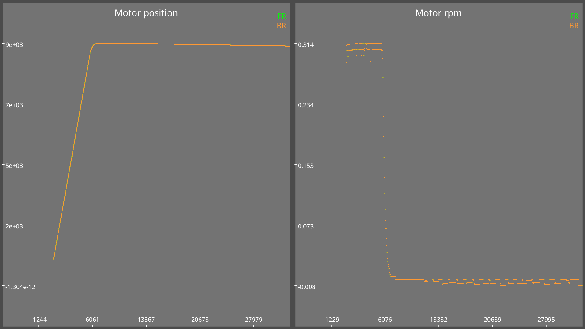

# MYBOT

An arduino robot built for NYCU ME 2024 mechanical practice course. It is a car-like robot that consists of a four wheel drive system and a 2 DOF robotic arm. The robot is running on FreeRTOS and controlled by smartphone via bluetooth.


## Hardware

- 1x Arduino Mega 2560
- 1x HC-05 Bluetooth Module
- 4x CHR-GM37 Motor with Encoder
- 2x RDS3235 35kg Servo
- 2x L298N Motor Driver
- 6x 18650 Battery
- 2x 18650 Battery Holder
- 2x Laser cutting aluminum plate

## Schematic

My teammate <a href="https://github.com/lulumy1015" target="_blank">@lulumy1015</a>
is responsible for the schematic design. The schematic is shown below.


## Control Method

### Bluetooth communicate

My teammate <a href="https://github.com/dragonwu0919" target="_blank">@dragonwu0919</a> is responsible for the bluetooth communication and the remote controller UI design.

The remote control program includes vehicle movement, arm control, and speed control. Steering involves clockwise/counterclockwise rotation for precise control. Arm functions include resetting, positioning, taking, and dropping ping pong balls. Speed settings help with alignment. Signals are periodically transmitted for movement and initiated by button press for arm control. This periodic transmission is managed by a timer, triggering Bluetooth transmission and countdown cycles.



### Setup


### Main Control Loop


### Arm Control


### COMP_PID

To control the wheel, we use a COMP_PID controller. The COMP_PID controller is a PID controller that can adjust the weight of the position and velocity error. The controller is shown below.

The plate is able to move by a designated velocity and position.
I write a script the make the plate to move to a target point in the map. However, it is not used in the final version, because we found out that our pilot is just as good as the script.  


$$
\begin{align*}
\text{pos weight base} &= 100 \\
\text{pos error percent} &= \frac{|\text{pos error}|}{\text{pos error max}} \quad \text{(Value domain: } [0, 1]) \\
\text{vel weight} &= \frac{{\text{pos weight base}}^{\text{pos error percent}} - 1}{\text{pos weight base} - 1} \quad \text{(Value domain: } [0, 1]) \\
\text{pos weight} &= 1 - \text{vel weight}
\end{align*}
$$

Some experiment data is shown below.


## Usage

It is recommended to use the docker image to compile the code, you can also use the platformio extension in vscode.

For docker user, you can use the following commands:

To build the docker image

```sh
make install
```

To build the code and upload to the arduino

```sh
make
```

To compile the code only

```sh
make build
```

To upload the code to the arduino only

```sh
make upload
```

To attach the docker container

```sh
make attach
```

## Record Photos

Some old version arms and mechanical parts.


Making the robot.


Before the final competition.


We.


